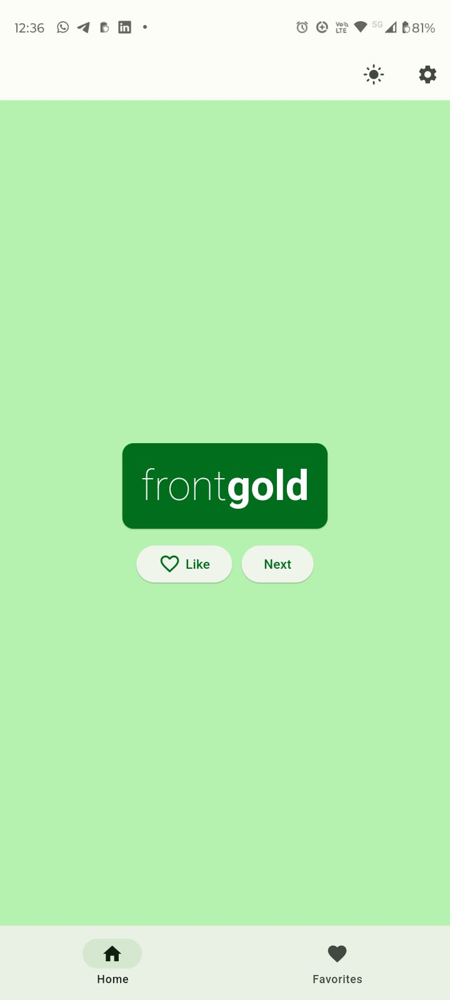
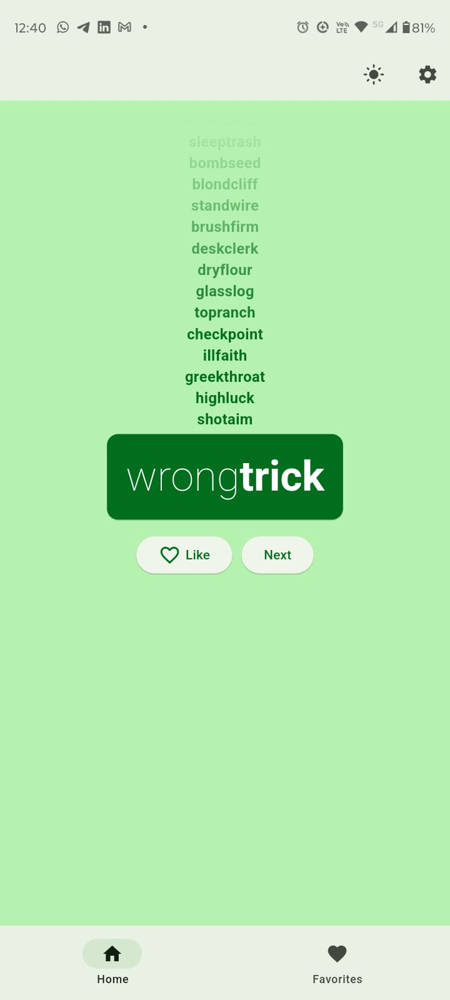

# Nice words

A flutter app to see (and save!) random and nice-sounding names.

This app was build following the codelab ["Your first Flutter app"](https://codelabs.developers.google.com/codelabs/flutter-codelab-first?hl=en), doing the [challenge at the end of the codelab](https://codelabs.developers.google.com/codelabs/flutter-codelab-first?hl=en#8) and some little extra features like theme mode, color pallete and save the local preferences and favorites.

## Quick tour

This app contains 3 pages:

- Home
- Favorites
- Settings

Let's walk through these ones!

### Home page

This page allows the user:

- see a random word
- toggle favorite the actual word
- tap to generate a new word
- Choose his favorite theme mode (light, dark or system)
- access the favorites and settings page

### Favorites page

This page shows to user its favorite words and allows to delete one of them (this action deletes forever).

<video width="320" height="240" controls>
 <source src="./docs/videos/favorites-page.mp4" type="video/mp4">
 Your browser does not support the video tag.
</video>

### Settings page

You can see a dialog about the app and set your preferred color pallete.

<video width="320" height="240" controls>
 <source src="./docs/videos/settings-page.mp4" type="video/mp4">
 Your browser does not support the video tag.
</video>

### Preferences

The app saves your favorites, preferred theme mode and color pallete wheter the app is opened or not.

<video width="320" height="240" controls>
 <source src="./docs/videos/data-persistence.mp4" type="video/mp4">
 Your browser does not support the video tag.
</video>
